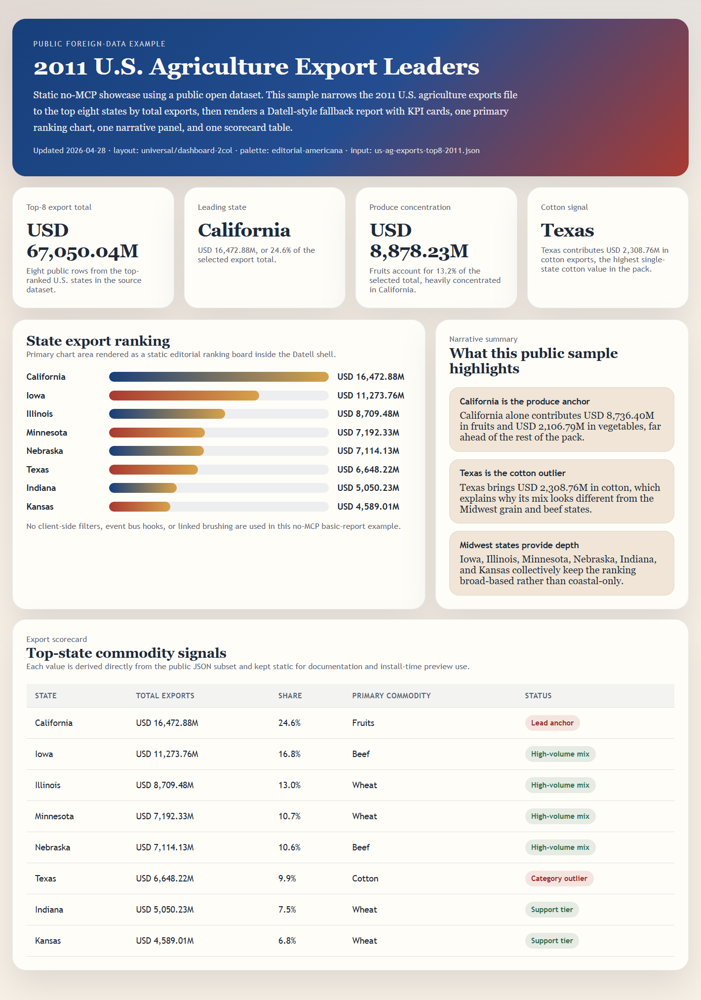

# Datell Agent Skills

Datell Agent Skills publishes a report-focused Agent Skills repository with one installable skill and an optional visual-report MCP runtime.

[](https://skills.sh/aiis2/frontend-design-report)
[](https://skills.sh/aiis2/frontend-design-report/datell-visual-report-preview)
[](https://skills.sh/aiis2/frontend-design-report/datell-visual-report-preview)
[](https://github.com/aiis2/frontend-design-report)

## Install

Install the published skill from GitHub with the Agent Skills CLI:

```bash
npx skills add aiis2/frontend-design-report --skill datell-visual-report-preview
```

The repository also ships `.claude-plugin/marketplace.json` for hosts that support Claude-style marketplace imports.

The public listing is already live on skills.sh:

- `https://skills.sh/aiis2/frontend-design-report`
- `https://skills.sh/aiis2/frontend-design-report/datell-visual-report-preview`

Quick links:

- Open the repository page on skills.sh: `https://skills.sh/aiis2/frontend-design-report`
- Open the skill detail page on skills.sh: `https://skills.sh/aiis2/frontend-design-report/datell-visual-report-preview`
- Open the GitHub repository: `https://github.com/aiis2/frontend-design-report`

skills.sh does not require a separate manual submission flow for this repository at the moment. Once the GitHub repository is public, installable, and indexed, the listing page becomes the publish surface.

## What You Get

- One installable skill: `datell-visual-report-preview`
- Preferred runtime path: call `datell_generate_chart` when a compatible MCP host is available
- Standalone fallback path: generate self-contained HTML that preserves the Datell layout, card, and palette system
- No-MCP basic-report mode: generate a static, non-interactive HTML report without filter controls, event-bus hooks, or cross-card linkage
- Optional MCP package scope: visual-report runtime only

## Skill Layout

The skill follows the Agent Skills directory model: a `SKILL.md` entry point with focused reference files loaded on demand.

- `skills/datell-visual-report-preview/SKILL.md`
- `skills/datell-visual-report-preview/references/datell-knowledge-index.md`
- `skills/datell-visual-report-preview/references/datell-layout-catalog.md`
- `skills/datell-visual-report-preview/references/datell-palette-catalog.md`
- `skills/datell-visual-report-preview/references/datell-card-catalog.md`
- `skills/datell-visual-report-preview/references/visual-report-pattern.md`

Use these references when you need the full Datell layout, palette, and card inventory instead of a reduced example subset.

## Example Gallery

### Public U.S. Agriculture Example



This public-facing example uses a foreign open dataset instead of an internal export. It demonstrates the exact no-MCP fallback contract with a static Datell-style report built from the top eight U.S. states by 2011 agriculture export value.

- Preview image: `skills/datell-visual-report-preview/assets/us-ag-exports-top8-2011-preview.png`
- Standalone HTML: `skills/datell-visual-report-preview/assets/us-ag-exports-top8-2011-basic-report.html`
- Example data: `skills/datell-visual-report-preview/assets/us-ag-exports-top8-2011.json`
- Public source: `https://raw.githubusercontent.com/plotly/datasets/master/2011_us_ag_exports.csv`

## Real-Data Validation Pack

The public repository now includes two validation packs: one normalized internal-origin export example and one public foreign dataset example.

### Normalized sales export example

- `skills/datell-visual-report-preview/assets/real-sales-december-2024.json`
- `skills/datell-visual-report-preview/assets/real-sales-december-2024-basic-report.html`

The input pack preserves 20 real December 2024 sales rows from an exported Datell report while translating labels to English for public publication. The HTML example shows the expected static basic-report result: KPI row, one primary chart area, one narrative block, and one scorecard table with no filter controls or linkage hooks.

### Public foreign dataset example

- `skills/datell-visual-report-preview/assets/us-ag-exports-top8-2011.json`
- `skills/datell-visual-report-preview/assets/us-ag-exports-top8-2011-basic-report.html`

This example uses a public U.S. agriculture export dataset and narrows it to the top eight states by total exports. It is intended for README demos, skills.sh listing previews, and install-time evaluation where a public English-only sample is more appropriate than a translated internal export.

## Local Validation

Install dependencies and run the repository checks:

```bash
npm install
npm run validate
```

This validates JSON files, repository layout, eval integrity, and the runnable MCP workspace.

## Support Policy

This repository currently ships only the report-preview skill and the matching visual-report MCP runtime.

Requests outside that surface, such as memory, RAG, or unrelated application runtime features, should be handled in a separate repository or design pass.

## Repository Layout

```text
.claude-plugin/
  marketplace.json
skills/
  datell-visual-report-preview/
    SKILL.md
    assets/real-sales-december-2024.json
    assets/real-sales-december-2024-basic-report.html
    assets/us-ag-exports-top8-2011.json
    assets/us-ag-exports-top8-2011-basic-report.html
    assets/us-ag-exports-top8-2011-preview.png
    evals/evals.json
    references/datell-chart-engine-playbook.md
    references/datell-card-catalog.md
    references/datell-design-system-playbook.md
    references/datell-knowledge-index.md
    references/datell-layout-catalog.md
    references/datell-palette-catalog.md
    references/visual-report-pattern.md
mcp/
  package.json
  README.md
  tsconfig.json
  src/index.ts
  scripts/smoke.mjs
scripts/
  validate-evals.mjs
  validate-json.mjs
  validate-layout.mjs
```
